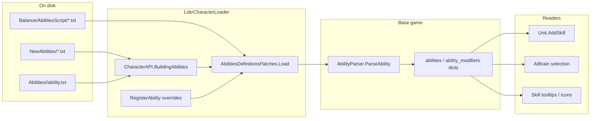

# Ability load path

How ability KV files become runtime `Ability` templates used by combat units.
Tier 1 covers **loading only**; ability parser internals and action types are
[Tier 3](base-game-documentation-checklist.md) (`AbilityParser`, expression model).

**Related hubs:** [Unit load path](unit-load-path.md) · [Roster load path](roster-load-path.md)

---

## End-to-end flow

1. **Vanilla assets** — `ResourcesWrapper.LoadAll<TextAsset>("Balance/AbilitiesScript")`.
2. **Mod injection** — `AbilitiesDefinitionsPatches` replaces `Load()`, fires `CharacterAPI.BuildingAbilities`, splices mod KV text, then applies code-registered abilities from `RegisterAbility`.
3. **Parse** — each top-level KV block becomes an `Ability` or `Modifier` via `AbilityParser`.
4. **Lookup** — `AbilitiesDefinitions.instance.abilities["myAbilityId"]` at runtime; units reference abilities by id from their `skills` list.

`Load()` is **one-shot** (`abilities.Count > 0` guard) during normal startup.

**Live reload:** call `CharacterAPI.ReloadLabContent(ReloadScope.Abilities)` or
`AbilitiesDefinitions.ForceReload()` after editing ability files — no full game restart
required when using Character Lab / Ability Lab save flow. See
[`roadmaps/started/live-reload.md`](roadmaps/started/live-reload.md).

---

## File format vs code

| Concern | Character File Reference | Base Game Reference |
|---------|--------------------------|---------------------|
| KV block fields, `AbilityBehavior` | [Abilities](api/character-reference/abilities.html) | — |
| Action type names | [Appendices §Q](api/character-reference/appendices.html) | `AbilityParser` (Tier 3) |
| Loader + registries | — | [AbilitiesDefinitions](api/base-game/Ironhide/Legends/Model/Game/Units/Abilities/AbilitiesDefinitions.html) |
| Runtime ability object | — | [Ability](api/base-game/Ironhide/Legends/Model/Game/Units/Abilities/Ability.html) |
| Skill icons | [Abilities](api/character-reference/abilities.html) | [DataHelper](api/base-game/DataHelper.html) (`LoadSkillIcon`) |

Unit definitions list ability ids in `skills` / `defaultSkill`; the loader does not auto-attach abilities to heroes without those references.

---

## Mod extension points

| Mechanism | When | Typical use |
|-----------|------|-------------|
| `CharacterAPI.BuildingAbilities` | During `Load()` | Append raw KV fragments (`NewAbilities/*.txt`, `Abilities/<id>/ability.txt`) |
| `CharacterAPI.RegisterAbility` | After file parse | Register or override an `Ability` in code (same id replaces file) |
| Duplicate ability id in merged text | Same id in two fragments | Later registration wins (file merge + code override policy) |

Default convention: hand-authored `Mods/*/NewAbilities/*.txt` plus Ability Lab `Mods/*/Abilities/<id>/ability.txt`. Shared `Mods/Resources/NewAbilities/` still loads.

---

## Key gotchas

- **Passive vs active** — `AbilityBehavior` flags determine whether `Unit` registers the skill as interactive; see Character File Reference.
- **Modifiers are separate** — `ability_modifiers` dict holds modifier templates referenced by `ApplyModifier` actions.
- **Localization** — ability display strings use `LocalizationId` keys merged via `ContributingLocalization` (separate load path).
- **Shared library** — LokrAbilityLab will store abilities mod-wide, not per character; same loader backend.

---

**Last reviewed:** 2026-08-12
