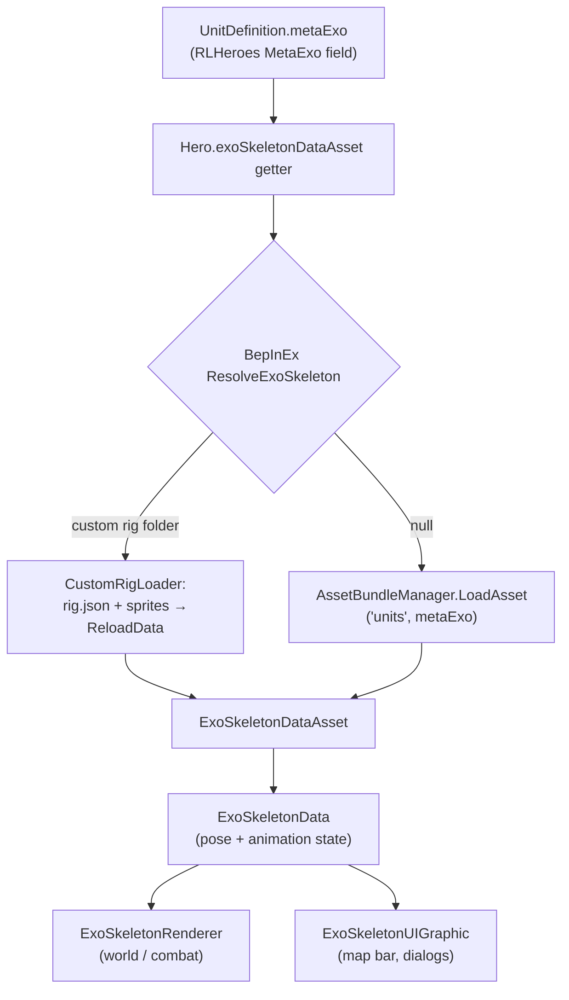

# ExoSkeleton pipeline

How hero rig assets become animated portraits and combat sprites. Covers the
vanilla bundle path, the `ReloadData` JSON runtime-build path, and BepInEx
custom-rig support.

**Capability context:** [capabilities-and-gaps.md](capabilities-and-gaps.md) §2.1  
**Mod implementation:** [CustomRigLoader](../LokrCharacterLoader/docs/custom-rig-loader.md)

---

## Two ways to get a rig

### Vanilla: pre-baked bundle asset

1. `Hero.exoSkeletonDataAsset` lazy-loads on first access.
2. Calls `AssetBundleManager.LoadAsset<ExoSkeletonDataAsset>("units", metaExo)`.
3. Asset must already exist in the shipped `units` bundle under that exact name.
4. **New `MetaExo` strings fail** — no mod injection into bundles; lookup returns null and UI/combat rig setup breaks.

Community mods reuse existing names (e.g. `ExoSkeletonHumanRanger_MetaDataAsset`) and reskin textures only.

### Runtime: `ReloadData(json, sprites)`

Builds an in-memory `ExoSkeletonDataAsset` from JSON + packed sprite atlas:

- **Dev tool:** `ExternalLoaderController` reads `.txt` JSON + `x1/*.png` for preview.
- **Mods:** `CustomRigLoader` reads `Mods/*/Characters/<RigId>/rig/rig.json` + `sprites/*.png`, packs via `ModAPI.Assets.PackSprites`, calls `ReloadData`.
- **Character Lab:** `BuildFromFolder` for editor preview without mod folder layout.

`<RigId>` must equal the hero's `metaExo` value. `HeroExoSkeletonPatches` seeds the cached asset before the vanilla getter runs.

---

## Class roles

| Class | Role | Doc |
|-------|------|-----|
| `ExoSkeletonDataAsset` | ScriptableObject schema; **`ReloadData` parses JSON** | [page](api/base-game/Ironhide/ExoSkeleton/ExoSkeletonDataAsset.html) |
| `ExoSkeletonData` | Runtime pose on a GameObject; `SetAnimFrame`, `LoadParts` | [page](api/base-game/Ironhide/ExoSkeleton/ExoSkeletonData.html) |
| `ExoSkeletonRenderer` | World mesh in `LateUpdate` | [page](api/base-game/Ironhide/ExoSkeleton/ExoSkeletonRenderer.html) |
| `ExoSkeletonUIGraphic` | UI `MaskableGraphic` mesh | [page](api/base-game/ExoSkeleton/Code/ExoSkeletonUIGraphic.html) |
| `AssetBundleManager` | Shipped bundle lookup ceiling | [page](api/base-game/Ironhide/AssetBundles/AssetBundleManager.html) |
| `ExternalLoaderController` | Dev-only atlas + ReloadData reference | [page](api/base-game/Ironhide/ExoSkeleton/ExternalLoaderController.html) |
| `Hero.exoSkeletonDataAsset` | Lazy load / mod injection point | [Hero page](api/base-game/Ironhide/Legends/Model/Metagame/Heroes/Hero.html) |

---

## `ReloadData` JSON schema (summary)

Full schema ground truth is `ExoSkeletonDataAsset.ReloadData` in ih-original. Top-level keys:

| Key | Purpose |
|-----|---------|
| `partScaleCompensation` | Optional float; scales part vertices |
| `parts` | Static part defs: `name`, `offsetX`, `offsetY` (mesh from matching sprite) |
| `animations` | Named clips with `frames[]` |
| `rootMotions` | Optional horizontal move curves per animation |

Each animation frame contains:

- `duration` — seconds for this frame
- `parts[]` — `name`, `matrix` (6 floats, Flash-style affine), optional `alpha`
- `events[]` — animation event id strings
- `attachPoints[]` — `name`, `matrix`, `index`

Sprite names in JSON must match PNG filenames in the packed atlas (case-insensitive; `#` suffix stripped when matching).

**Required animations for map UI:** `Stand` plus (`Portrait` or `StandStatic`). Missing these crashes or breaks hero bar when the hero is shown.

---

## BepInEx patches (texture reskin vs custom rig)

| Patch | What it does |
|-------|----------------|
| `HeroExoSkeletonPatches` | Custom rig via `CharacterAPI.ResolveExoSkeleton` |
| `ExoSkeletonRendererPatches` | Replace world rig texture from `Mods/*/Exoskeletons/<name>.png` |
| `ExoSkeletonUIGraphicPatches` | Same reskin for UI rig renderers |

Texture reskin keeps vanilla skeleton geometry; custom rig replaces geometry and animations entirely.

---

## Key gotchas

- Reusing a vanilla `MetaExo` name with only texture reskin is the common Official Pack pattern.
- A **new** `MetaExo` name requires a matching `Characters/<RigId>/` folder and the Hero patch — not bundle editing.
- World and UI renderers share one `ExoSkeletonData` instance but build meshes differently (world units vs UI pixel scale).
- Some UI code loads rigs via `AssetBundleManager` directly, not only through `Hero.exoSkeletonDataAsset`; custom rigs target the Hero getter path first.

---

**Last reviewed:** 2026-08-12
