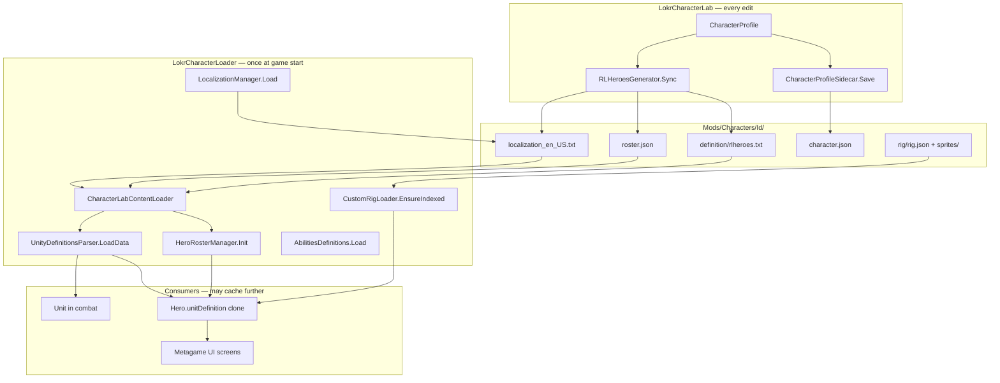

# Live reload roadmap

**Status:** Phase 2 complete — Phase 3 (selective reload) next  
**Raised:** 2026-08-11  
**Last updated:** 2026-08-15  
**Owner:** LokrCharacterLoader + LokrCharacterLab (cross-plugin)

See also [Character Creator roadmaps](../README.md).

**Current:** Phase 1–2 are in the running game (`Reload in Game`,
auto-reload on lab close). Properties still write through
(`PersistAndSync`). Animator and Ability edits wait on File → Save /
Ctrl+S ([lab-save-ux.md](../completed/lab-save-ux.md)). Phase 3 (selective/scoped
reload) is next. The problem statement below is the original gap.

---

## Phase 0 investigation log

Initial code-review findings (2026-08-12). Runtime verification still needed via
the manual test matrix below.

### 0.1 Hero lifecycle (code review — partial)

| Finding | Detail |
|---------|--------|
| Construction | `Hero` constructor clones `UnityDefinitionsParser.instance.GetDefinition(archetype)` into `hero.unitDefinition` and caches `_exoSkeletonDataAsset` lazily. |
| Storage | Live party/recruited heroes live in `HeroManager.heroes` (`MetagameManager.instanceNoLoad.heroManager`). |
| Stale risk | `Hero.unitDefinition` is a **snapshot**; parser reload alone does not update existing heroes. |
| Mitigation implemented | `MetagameHeroReloader` no longer re-runs `UpdateSkills`. **[`LokrPatch`](../../../LokrPatch/docs/overview.md)** dedupes hero skill lists and skips duplicate `Unit.AddSkill` registrations instead of throwing. |
| Party lookup | `HeroManager.UnitDefinitionForHero` re-queries the parser on demand, but UI paths often use `hero.unitDefinition` directly. |

### 0.2 Metagame UI refresh (code review — partial)

| Screen | Data source on open | Stale risk without hero refresh |
|--------|---------------------|----------------------------------|
| Hero room (`UIHeroRoomHeroData.SetHero`) | Banner via `DataHelper.LoadHeroBanner`; stats/skills from `Hero` | **High** for stats/skills; portrait rig uses cached `exoSkeletonDataAsset` |
| Roster lists | `HeroRosterManager.heroRosterConfig` | Reload `Init()` refreshes config; unlock/XP from save unchanged |
| Localization labels | `LocalizationManager.instance.LocalizeString` | Reload `Load()` refreshes strings |

**Working hypothesis:** Reload managers + refresh heroes, then **re-open** hero room
(closing Lab first). In-place refresh while hero room stays open is Phase 4.

### 0.3–0.6 Spikes (implemented in Phase 1 MVP)

| Task | Implementation |
|------|----------------|
| 0.3 Unit definitions | `ContentReloader.ReloadUnitDefinitions()` → `LoadData` via Harmony patch |
| 0.4 Roster | `HeroRosterManager.Init()` re-invoked on live manager |
| 0.5 Rigs | `CustomRigLoader.ClearCaches()` + hero exo field cleared |
| 0.6 Localization | `LocalizationManager.Load(currLanguageCode)` re-invoked |

### 0.7 Save safety (design invariant)

`HeroRosterManagerPatches.Init` replacement only swaps `heroRosterConfig` and
rebuilds XP brackets — it does **not** touch `heroRosterState` (per-save unlock/XP).
**Must verify manually** (test T9).

### 0.8 Safe game states (preliminary)

| State | Reload allowed? | Notes |
|-------|-----------------|-------|
| Character Lab open | Yes (MVP) | User clicks **Reload in Game** on Home panel |
| Main menu / map, Lab closed | Yes | Preferred verification path |
| Hero room open | Unknown | Re-open after reload recommended |
| Active encounter | **No** (v1) | Out of scope |

---

## Phase 1 implementation status

| Item | Status |
|------|--------|
| `CharacterAPI.ReloadScope` / `ReloadResult` | Done |
| `CharacterAPI.ReloadLabContent()` | Done |
| `ContentReloader` | Done |
| `MetagameHeroReloader` | Done |
| `CustomRigLoader.ClearCaches()` | Done |
| `AbilitiesDefinitionsPatches.ForceReload()` | Done |
| Lab **Reload in Game** button (Home panel) | Done |
| Auto-reload on Lab close (`AutoReloadOnLabClose` config) | Done |
| `character-api.md` update | Done |

**How to test:** Edit a stat → close Lab (auto-reload) or **Reload in Game** on Home → open hero
room → confirm stat. Log line: `ContentReloader: reloaded ...` or `Auto-reload on Lab close completed`.

---

## Summary

Character Lab Properties edits are written to disk immediately
(`PersistAndSync` → `RLHeroesGenerator.Sync`). Animator and Ability
edits wait on File → Save / Ctrl+S. The running game still builds much
of its in-memory character data **once at boot**; Phase 1–2 reload
re-reads Lab content without a process restart, but seeing a change in
gameplay without using **Reload in Game** / auto-reload on lab close
still needs a full restart.

**Goal:** Close that gap so mod authors can iterate on characters without
relaunching the game.

**Realistic v1:** Edits made in the Lab are visible the next time the player
opens relevant metagame UI (hero roster, hero room, map party bar) — **not**
necessarily mid-combat on units already spawned in an active encounter.

This document is the dedicated plan for that work. The Character Creator
roadmap still tracks *what* the Lab edits; this doc tracks *how those edits
reach the live game*.

---

## Problem statement

### What works today

| Layer | Behavior |
|-------|----------|
| **Lab authoring** | Properties / General still write through (`PersistAndSync`). Animator and Ability edits set dirty and flush on File → Save / Ctrl+S ([lab-save-ux.md](../completed/lab-save-ux.md)). |
| **On-disk truth** | `definition/rlheroes.txt`, `roster.json`, `localization_en_US.txt`, `rig/rig.json`, `sprites/*.png` are always current after an edit. |
| **Readiness checklist** | Re-reads those files from disk — correctly reflects Lab output. |
| **Rig preview (Lab only)** | `CustomRigLoader.BuildFromFolder` bypasses caches; preview is live. |

### What does not work

| Layer | Behavior |
|-------|----------|
| **Game runtime** | Phase 1–2 reload re-reads Lab content without a process restart. Selective/scoped reload (Phase 3) is not built; `ReloadLabContent` still tends to take a wide scope. |
| **Hero instances** | Each `Hero` clones a `UnitDefinition` at construction and caches `exoSkeletonDataAsset` on first access. |
| **Combat `Unit` instances** | Spawned from definitions resolved at encounter setup; hold live stat/skill state separate from the parser singleton. |

The readiness checklist and the live game therefore **diverge** after the first
Lab edit in a session — not because files are wrong, but because the game is
still serving boot-time snapshots.

---

## Architecture (write vs read)



**Key insight:** `CharacterLabContentLoader` already knows how to read Lab
output from disk — it just runs inside one-shot boot hooks. Live reload is
mostly **re-invoking those hooks safely**, plus **invalidating downstream
caches** that boot never had to worry about.

---

## Cache inventory

Every layer that can serve stale data after a Lab edit. Reload design must
address each row relevant to the edit type.

| # | System | Location | Guard / trigger | What it caches | Re-reads disk on reload? |
|---|--------|----------|-----------------|----------------|-------------------------|
| 1 | Hero roster config | `HeroRosterManager.heroRosterConfig` | `Init()` replaced by patch; runs once | Parsed `HeroRosterConfig` (legend/companion entries) | Yes — patch re-merges JSON from disk via `BuildingHeroRoster` |
| 2 | Unit definitions | `UnityDefinitionsParser` singleton | `LoadData()` in constructor; singleton never recreated | `Definitions`, `DefinitionsByUnique` | Yes — patch rebuilds dictionaries from vanilla assets + mod fragments |
| 3 | Abilities | `AbilitiesDefinitions.abilities` | `Load()` early-out when `abilities.Count > 0` | Parsed `Ability` objects | Yes — must clear collections before re-`Load()` |
| 4 | Rig folder index | `CustomRigLoader` `indexed` + `rigFoldersById` | `EnsureIndexed()` once | Character folder paths by rig id | Yes — reset `indexed`, re-scan |
| 5 | Built rigs | `CustomRigLoader.builtRigsById` | First `Resolve(metaExo)` per id | `ExoSkeletonDataAsset` (atlas + JSON) | Yes — clear dict; rebuild on next resolve |
| 6 | Localization strings | `LocalizationManager` internal dicts | `Load(language)` per language switch | Merged KV strings | Yes — patch rebuilds from files + `ContributingLocalization` |
| 7 | Known unit defs (mod API) | `CharacterAPI.knownUnitDefinitionsById` | Populated during `UnitDefinitionLoaded` | Observed definitions | Clear or rebuild with #2 |
| 8 | Hero `unitDefinition` | `Hero` instance field | Set in constructor via `GetDefinition(...).Clone()` | **Snapshot** — not live parser lookup | **No** — must refresh or recreate `Hero` |
| 9 | Hero rig asset | `Hero._exoSkeletonDataAsset` | Lazy on first getter access | `ExoSkeletonDataAsset` reference | **No** — must null field or recreate `Hero` |
| 10 | Hero `dummyUnit` | `Hero` (internal) | Built from `unitDefinition` | Preview combat unit | Refreshed when stats refresh if `unitDefinition` updated |
| 11 | Sound clip paths | `SoundPatches` resolver closure | Per-path `AudioClip` cache | Decoded WAV clips | Only if sound **files** change (not stat edits) |
| 12 | Portrait sprites | Portrait resolver chain | Loaded per request | Sprite assets | Re-resolve if portrait paths / rig changes |
| 13 | Save-game roster state | `HeroRosterManager.heroRosterState` | Per-save unlock/XP/party | **Player progress** — not definition data | **Must not wipe** on content reload |
| 14 | Active combat `Unit` | Encounter scene | Spawn-time | Live HP, buffs, position | **Out of v1 scope** |

---

## Edit type → reload requirements

What a mod author changes in the Lab, which files change, and what reload must
cover for that change to appear in metagame UI.

| Lab edit | Files touched | Minimum reload | Also consider |
|----------|---------------|----------------|---------------|
| Stats, states, skills, sound, appearance KV (`Model`, `AttackType`, icons…) | `rlheroes.txt` | #2 Unit definitions | #8–9 Hero refresh for heroes already constructed |
| Name, description | `localization_en_US.txt` | #6 Localization | UI may cache localized strings until refresh |
| Roster locked / tier / unlock achievement | `roster.json` | #1 Roster config | #6 if name keys change |
| New character folder | all of the above + rig | #1–5 full content reload | Party/save may not reference new id until selected |
| Rig JSON / sprites / animations | `rig/rig.json`, `sprites/` | #4–5 Rig caches | #9 Hero exo cache; portrait/map UI (#12) |
| Skill **behavior** (Ability Lab, not Character Lab) | `Mods/LokrAbilityLab/Abilities/<id>/ability.txt` (or hand-authored `Mods/*/NewAbilities/*.txt`) | #3 Abilities | Combat uses ability defs at cast time — investigate |
| Sound **files** (new WAV) | `Characters/<id>/sounds/` (or legacy `Mods/*/Sounds/<id>/`) | #11 Sound cache | Only if event → file mapping changed |

Character Lab Properties + General + Animator map to the first five rows.
Ability Lab is adjacent but shares the same boot-time ability loader.

---

## Goals and non-goals

### Goals

1. **G1 — No restart for metagame iteration:** After editing in the Lab, return
   to the main menu (or map), open hero roster / hero room / manage screen, and
   see updated stats, skills, name, portrait rig, etc.
2. **G2 — Single public entry point:** `CharacterAPI.ReloadLabContent(...)` (name
   TBD) in LokrCharacterLoader; Lab calls it — Lab does not reach into patch
   internals.
3. **G3 — Safe by default:** Reload must not destroy save progress (unlock state,
   XP, party selection, run progress).
4. **G4 — Observable:** Log what was reloaded, how long it took, and whether any
   step failed; optional in-Lab status line ("Game content reloaded" / error).
5. **G5 — Investigation artifacts:** Document which UI entry points re-query
   managers vs hold stale references (see Phase 0).

### Non-goals (explicit)

| Item | Reason |
|------|--------|
| Hot-reload **during active combat** | Live `Unit` instances, turn state, AI — high crash/regression risk |
| Hot-reload **Ability Lab mid-fight** | Separate scope; shares ability loader but different authoring UX |
| Replacing Unity `Resources` assets | Mod path only; vanilla balance files still require restart |
| Automatic reload on **every keystroke** | Too expensive; debounced or manual/on-exit trigger |
| Multiplayer / sync | N/A for this game mode |

---

## Phased delivery

### Phase 0 — Investigation (current)

**Outcome:** Written answers to the open questions below, a ranked list of UI
entry points to test, and a minimal spike proving one loader can reload safely.

| Task | Deliverable | Done when |
|------|-------------|-----------|
| **0.1** Trace `Hero` lifecycle | Doc section: when are `Hero` objects created, where stored (`MetagameManager`, party, UI temp instances)? | List of fields that hold `Hero` references |
| **0.2** Audit metagame UI refresh | For hero room, roster screen, map bar, manage-skills: on `Show`/`Open`, do they read `HeroRosterManager` + `Hero.unitDefinition` fresh or cache? | Table: screen → data source → stale risk |
| **0.3** Unit definition reload spike | Dev console or temporary BepInEx config key that clears `UnityDefinitionsParser` dicts and re-runs patched `LoadData` logic | Log shows new stat value without process restart |
| **0.4** Roster reload spike | Same for `HeroRosterManager.Init` replacement | New `locked` flag visible in roster data |
| **0.5** Rig reload spike | Clear `CustomRigLoader` caches + null `Hero._exoSkeletonDataAsset` for one test hero | Map portrait shows edited rig |
| **0.6** Localization reload spike | Re-run patched `LocalizationManager.Load` for current language | Updated name string in UI |
| **0.7** Save safety check | Confirm reload does not reset `heroRosterState`, party, or run flags | Documented invariant + test notes |
| **0.8** Failure modes | Attempt reload while hero room open, while map visible, while Lab scene loaded | List of safe vs unsafe game states |

**Exit criteria for Phase 0:** Phase 1 scope is confirmed or narrowed with
evidence; no unknown show-stopper caches remain.

---

### Phase 1 — Manual dev reload (MVP)

**Outcome:** A callable API + dev trigger; author explicitly reloads after editing.

**API sketch:**

```csharp
// LokrCharacterLoader / CharacterAPI.cs (public)
public static class CharacterAPI
{
    [Flags]
    public enum ReloadScope
    {
        None = 0,
        UnitDefinitions = 1 << 0,
        HeroRoster = 1 << 1,
        Localization = 1 << 2,
        Rigs = 1 << 3,
        Abilities = 1 << 4,
        Visuals = 1 << 5,
        /// <summary>Typical Character Lab exit: units + roster + loc + rigs.</summary>
        LabCharacterDefaults = UnitDefinitions | HeroRoster | Localization | Rigs,
        All = LabCharacterDefaults | Abilities | Visuals,
    }

    public struct ReloadResult
    {
        public bool Success;
        public ReloadScope Completed;
        public string ErrorMessage;
        public double ElapsedMs;
    }

    /// <summary>
    /// Re-reads mod character content from disk into runtime caches.
    /// Does not reset save-game progress. See roadmaps/started/live-reload.md.
    /// </summary>
    public static ReloadResult ReloadLabContent(ReloadScope scope = ReloadScope.LabCharacterDefaults);
}
```

**Implementation notes (LokrCharacterLoader):**

1. **Unit definitions** — Clear `UnityDefinitionsParser.instance` internal dicts
   (via `Traverse` or new internal helper), re-invoke patched load path. The
   public `UnityDefinitionsParser.instance` setter may allow replacing the
   singleton entirely; verify side effects.
2. **Roster** — Re-run `HeroRosterManagerPatches` init body against existing
   manager instance; **do not** clear `heroRosterState`.
3. **Localization** — Re-run patched `Load` for `LocalizationManager` current
   language only.
4. **Rigs** — `CustomRigLoader.ClearCaches()` (new internal/public method):
   `indexed = false`, `rigFoldersById.Clear()`, `builtRigsById.Clear()`.
5. **Hero instances** — `HeroContentReloader.RefreshMetagameHeroes()` (new):
   foreach known `Hero`, re-clone `unitDefinition` from
   `DefinitionsByUnique`, null `_exoSkeletonDataAsset`, call existing stat
   refresh paths if any.
6. **Abilities** — Clear `abilities` + `ability_modifiers`, call `Load()` again
   (only when `ReloadScope.Abilities` set).
7. **Visuals** — `CustomFxLoader.Refresh()` rebuilds sprite FXMega /
   projectile prefabs and re-injects into `FXManager` (only when
   `ReloadScope.Visuals` set). Ability Lab save requests Abilities | Visuals.

**Lab trigger (Phase 1):**

- Menu bar or Home workstation: **"Reload in game"** button (dev-facing label).
- Calls `CharacterAPI.ReloadLabContent()` after last `PersistAndSync`.
- Shows result in status line.

**Exit criteria:** User edits a stat in Properties, clicks Reload, returns to
main menu, opens hero room — stat matches file on disk.

---

### Phase 2 — Reload on Lab exit

**Outcome:** Reload happens automatically when closing Character Lab (configurable).

**Status (2026-08-12):** Implemented — `AutoReloadOnLabClose` in `com.lokrmodding.lab.cfg`
(default `true`).

**Update (2026-08-17):** Close Lab flushes focused Properties fields, then
`CharacterLabScene.CloseTo` always calls `ReloadLabContent(All)` in a
try/catch (not only from `LabClosing`). In-game confirm:
[`override-description-needs-restart.md`](../../issues/resolved/override-description-needs-restart.md).

**Update (2026-08-12):** Character Lab now uses a **real scene transition** — opening
the lab unloads the origin scene; closing returns via `TransitionSceneComponent`.
Reload-on-close still runs when `AutoReloadOnLabClose` is enabled. Ability Lab
remains an additive overlay (opened from the mod menu without unloading the game
scene).

**Update (2026-08-15):** `LabContentReloader.ReloadCurrentCharacter` (sandbox
and auto-reload-on-close) uses `ReloadScope.All` so imported abilities are
in `AbilitiesDefinitions`. Ability Lab save still requests Abilities |
Visuals only.

- Hook `CharacterLabScene.Close()` (after unload starts or before) →
  `ReloadLabContent(LabCharacterDefaults)`.
- BepInEx config: `AutoReloadOnLabClose` (default `true` for dev builds? default
  `false` until stable? — decide in Phase 1 testing).
- If Lab close while in unsupported game state (Phase 0.8), skip reload and log.

**Exit criteria:** Same as Phase 1 without manual button press.

---

### Phase 3 — Selective / scoped reload

**Outcome:** Faster reload when only one category changed.

- `PersistAndSync` tracks dirty flags (properties vs rig vs general).
- Pass minimal `ReloadScope` to avoid re-packing all rig atlases when only a
  stat changed.
- Optional: reload single character id (filter `CharacterLabContentLoader` reads)
  — only if Phase 1 full reload is too slow.

**Exit criteria:** Stat-only edit reload completes in &lt; 500 ms on dev machine
(target — measure in Phase 1).

---

### Phase 4 — Future (not planned)

- Mid-encounter unit definition hot-swap
- Live reload while hero room screen stays open (in-place UI refresh)
- Coordinated Ability Lab + Character Lab reload

---

## Open questions (from original roadmap, expanded)

| # | Question | Investigation task | Impact if "yes" |
|---|----------|-------------------|-----------------|
| Q1 | Do metagame screens re-query `HeroRosterManager` / parser on each open? | 0.2 | Reloading managers may be sufficient |
| Q2 | Do screens hold stale `Hero` / `UnitDefinition` references? | 0.1, 0.2 | Need hero refresh or force UI rebuild |
| Q3 | Is mid-combat reload ever safe? | 0.8 + code review of `Unit` spawn | Probably defer to Phase 4 |
| Q4 | Does `Hero.RefreshStats` pick up new base stats from replaced `unitDefinition`? | Read `Hero.cs` + test 0.3 | Defines hero refresh implementation |
| Q5 | Are new characters (first boot after create) visible without reload? | Trace boot vs create flow | May already work on restart only |
| Q6 | Portrait / map bar: texture or rig cached in UI components? | 0.5 + PortraitPatches trace | May need `UpdateAsset` on open ExoSkeleton views |
| Q7 | Does reloading abilities break in-progress run skill unlock state? | 0.7 | May exclude abilities from default scope |
| Q8 | Thread / re-entrancy: can reload run while Lab scene still loaded? | 0.8 | Define allowed game states for reload |

---

## Risk register

| Risk | Likelihood | Impact | Mitigation |
|------|------------|--------|------------|
| Wiping save progress (XP, unlocks, party) | Medium | Critical | Never touch `heroRosterState`; test 0.7; code review checklist |
| Null ref in UI holding old `UnitDefinition` | High | High | Phase 0.2 audit; refresh heroes + document "close hero room first" |
| Rig reload memory leak (old `ScriptableObject` assets) | Medium | Medium | `Destroy` old cached assets when clearing `builtRigsById` |
| Reload during Lab scene active | Medium | High | Only allow from main menu / map, or after Lab unload completes |
| Partial reload (units refreshed, rigs not) | Medium | Confusing | Default bundled scope; log completed flags |
| Duplicate mod characters after reload | Low | Medium | Reload replaces same keys — same as boot behavior |
| Performance hitch on reload | Medium | Low | Phase 3 selective scope; async rig rebuild (future) |

---

## Test matrix (manual)

Use after Phase 1 implementation. Edit one field per row, reload, verify in
game without process restart.

| # | Edit in Lab | Verify in game | Pass criteria |
|---|-------------|----------------|---------------|
| T1 | `health_max` stat | Hero room stat display / combat dummy | Value matches `rlheroes.txt` |
| T2 | `defaultSkill` | Hero room default attack | Skill id updated |
| T3 | Display name (General) | Hero room name label | Localization string updated |
| T4 | `locked: false` in roster | Roster selectable | Hero appears unlocked |
| T5 | Rig `Stand` animation frame | Map hero bar / hero room portrait | Visible pose change |
| T6 | New sound event mapping | Hero room select sound / combat hit | New clip plays (may need sound cache clear) |
| T7 | Add new skill to list | Manage skills UI | Skill appears in list |
| T8 | Reload twice in a row | Any screen | No duplicate entries, no crash |
| T9 | Reload with save loaded | XP / unlock unchanged | Same level and unlock state as before |
| T10 | Edit → reload → enter combat | New recruit stats | **Stretch** — document pass/fail for v1 scope |

**Game states to test reload from:**

- Main menu (Lab closed)
- Adventure map (Lab closed)
- Hero room open (**expect fail or require close-first** until Phase 4)
- Inside encounter (**out of scope**)

---

## Related documentation

| Doc | Relevance |
|-----|-----------|
| [../../unit-load-path.md](../../unit-load-path.md) | `UnityDefinitionsParser` one-shot load |
| [../../roster-load-path.md](../../roster-load-path.md) | `HeroRosterManager.Init` |
| [../../ability-load-path.md](../../ability-load-path.md) | `AbilitiesDefinitions.Load` guard |
| [../../exoskeleton-pipeline.md](../../exoskeleton-pipeline.md) | Rig `ReloadData` + caches |
| [../README.md](../README.md) | Character Creator roadmap hub |
| [../completed/full-port/gaps.md](../completed/full-port/gaps.md) | Lab-authored file scope |
| [LokrCharacterLoader/character-api.md](../../../LokrCharacterLoader/docs/character-api.md) | Extension events reload must re-fire |
| [LokrCharacterLoader/custom-rig-loader.md](../../../LokrCharacterLoader/docs/custom-rig-loader.md) | Rig cache behavior |
| [LokrCharacterLoader/patches.md](../../../LokrCharacterLoader/docs/patches.md) | Full-method replacement patches |

---

## Code touchpoints (implementation checklist)

When Phase 1 starts, expect changes in:

| Project | Files / areas |
|---------|----------------|
| **LokrCharacterLoader** | New `ContentReloader.cs` (or similar); `CharacterAPI.ReloadLabContent`; `CustomRigLoader.ClearCaches()`; optional `HeroExoSkeletonPatches` helper to invalidate hero rig fields |
| **LokrCharacterLab** | Reload button + status; optional `CharacterLabScene.Close` hook; config entry |
| **Docs** | This file (status updates); `character-api.md` (public API); load-path hubs (note reload availability) |

---

## Revision history

| Date | Change |
|------|--------|
| 2026-08-11 | Problem raised in Character Creator roadmap |
| 2026-08-12 | Dedicated doc; Phase 1–2 implemented; moved to `docs/roadmaps/` |
