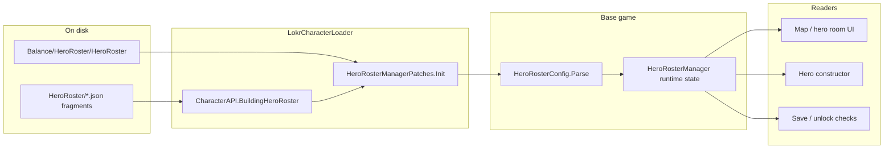

# Roster load path

How hero roster JSON becomes selectable legends/companions in the metagame.
Links [Character File Reference](api/character-reference/hero-roster.html) to
base-game code without duplicating JSON field docs.

**Related hubs:** [Unit load path](unit-load-path.md) · [Ability load path](ability-load-path.md)

---

## End-to-end flow

1. **Vanilla asset** — `ResourcesWrapper.Load<TextAsset>("Balance/HeroRoster/HeroRoster")` loads the base roster JSON.
2. **Mod injection** — `HeroRosterManagerPatches` replaces `Init()`, fires `CharacterAPI.BuildingHeroRoster`, and splices legend/companion JSON objects into the `"legends"` / `"companions"` arrays before parse.
3. **Parse** — `HeroRosterConfig.Parse(text)` strips `//` comments, deserializes with `JsonUtility`, builds `all` (by id) and `allOrdered`.
4. **Runtime** — `HeroRosterManager` tracks per-save unlock state, XP/level, and the active 3-hero `Party`. `IsUnlocked(id)` gates roster UI and hero construction.

`Init()` runs **once per process** on boot. Call `CharacterAPI.ReloadLabContent()` (or close Character Lab with `AutoReloadOnLabClose`) to pick up roster file changes without restarting — see [roadmaps/started/live-reload.md](roadmaps/started/live-reload.md).

---

## File format vs code

| Concern | Character File Reference | Base Game Reference |
|---------|--------------------------|---------------------|
| JSON fields (`id`, `locked`, `unlockAchievement`, …) | [Hero roster](api/character-reference/hero-roster.html) | — |
| Parse + indexes | — | [HeroRosterConfig](api/base-game/Ironhide/Legends/View/Metagame/Screens/Logic/HeroRosterConfig.html) |
| Unlock / XP / party | — | [HeroRosterManager](api/base-game/Ironhide/Legends/Model/Metagame/HeroRosterManager.html) |
| Metagame hero instance | — | [Hero](api/base-game/Ironhide/Legends/Model/Metagame/Heroes/Hero.html) |
| Unit data keyed by roster id | [RLHeroes](api/character-reference/rlheroes.html) | [Unit load path](unit-load-path.md) |

The roster `"id"` must match the level-1 block's `UniqueId` in `UnityDefinitionsParser.DefinitionsByUnique`.

---

## Mod extension points

| Mechanism | When | Typical use |
|-----------|------|-------------|
| `CharacterAPI.BuildingHeroRoster` | Before `HeroRosterConfig.Parse` | Append legend/companion JSON via `RosterBuilder` |
| Duplicate `"id"` in array | Same id twice | Last fragment wins when merged (convention: one mod entry per hero) |

Default scanning: `Mods/*/HeroRoster/*legend_*`, `*companion_*` (see [CharacterAPI](../LokrCharacterLoader/docs/character-api.md)).

Character Lab writes `hero-roster.json` under the character folder; `CharacterLabContentLoader` contributes it through the same event.

---

## Key gotchas

- **`unlockAchievement`** — when set on a roster entry, `HeroRosterManager.IsUnlocked` checks `AchievementManager.IsCompleted` before the hero appears selectable.
- **`locked: true`** — hero exists in data but stays locked until save/unlock logic clears it.
- **Party size** — active party is three hero ids; roster can list many more legends/companions.
- **Placeholder entries** — `placeholder: true` marks non-playable roster slots in UI.

---

**Last reviewed:** 2026-08-12
