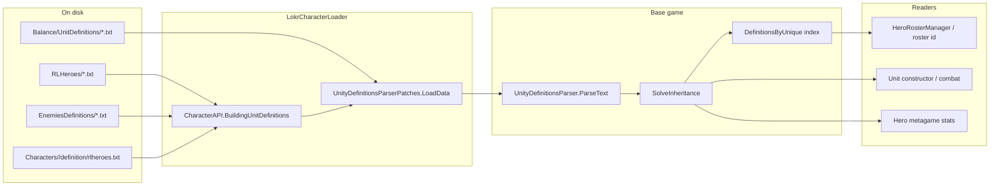

# Unit load path

How KV unit-definition files become in-memory `UnitDefinition` objects and how
mods inject content along that path. This hub links the **file-format docs**
(Character File Reference) to the **code docs** (Base Game Reference) without
re-stating field-by-field txt syntax.

**Related hubs:** [Roster load path](roster-load-path.md) · [Ability load path](ability-load-path.md) · [ExoSkeleton pipeline](exoskeleton-pipeline.md)

---

## End-to-end flow

At a high level:

1. **Vanilla assets** — `ResourcesWrapper.LoadAll("Balance/UnitDefinitions")` loads every base-game `.txt` under that resource path.
2. **Mod injection** — `UnityDefinitionsParserPatches` replaces `LoadData()`, fires `CharacterAPI.BuildingUnitDefinitions`, and appends each mod `TextAsset` contribution (from `RLHeroes/` and `EnemiesDefinitions/` folders, plus Character Lab `definition/rlheroes.txt` via `CharacterLabContentLoader`) as its own wrapped `units` document before parsing.
3. **Parse** — `ParseText()` turns each top-level KV block in each file into one `UnitDefinition` (keyed by block name → `UnitDefinition.id`).
4. **Inheritance** — `SolveInheritance()` walks every block with `InheritsFrom`, clones the resolved parent, and overlays the child's explicit fields. Up to 50 passes; unresolved chains log an error.
5. **Unique index** — `DefinitionsByUnique` keeps only **level-1** blocks (`stats.level == 1`) keyed by `UniqueId`. Roster ids, hero lookups, and most mod tooling use this index, not the raw block key.
6. **Runtime** — Combat spawns a `Unit` from a specific block id (often the rank-appropriate Lvl2/Lvl3 block). Metagame `Hero` objects merge map progression stats on top of the level-1 definition.

Load runs **once per process** on first access to `UnityDefinitionsParser.instance`. Call `CharacterAPI.ReloadLabContent()` (or close Character Lab with `AutoReloadOnLabClose`) to pick up file changes without restarting — see [roadmaps/started/live-reload.md](roadmaps/started/live-reload.md).

---

## File format vs code

| Concern | Character File Reference | Base Game Reference |
|---------|--------------------------|---------------------|
| KV block layout, level chains | [RLHeroes](api/character-reference/rlheroes.html) | — |
| Enemy/summon blocks | [Enemies definitions](api/character-reference/enemies-definitions.html) | — |
| Stat names, expressions, custom stats | [Stats and expressions](api/character-reference/stats-and-expressions.html) | [Stat](api/base-game/Ironhide/Legends/Model/Game/Units/Stat.html), [StatsParser](api/base-game/Ironhide/Legends/Model/Game/Units/StatsParser.html) |
| States / behavior flags | [States and tags](api/character-reference/states-and-tags.html) | [States](api/base-game/Ironhide/Legends/Model/Game/Units/States.html) |
| Sound clips on units | [Sound config](api/character-reference/sound-config.html) | — |
| Parser + indexes | — | [UnityDefinitionsParser](api/base-game/Ironhide/Legends/Model/Game/Units/UnityDefinitionsParser.html) |
| Parsed object shape | — | [UnitDefinition](api/base-game/Ironhide/Legends/Model/Game/Units/UnitDefinition.html) |
| Stat min/max clamps after load | — | [StatHelper](api/base-game/Ironhide/Legends/Model/Game/Units/StatHelper.html) |
| In-fight instance | — | [Unit](api/base-game/Ironhide/Legends/Model/Game/Units/Unit.html) |

---

## Mod extension points

| Mechanism | When it runs | Typical use |
|-----------|--------------|-------------|
| `CharacterAPI.BuildingUnitDefinitions` | Before any file is parsed | Append or replace raw KV text (`UnitDefinitionsBuilder.RLHeroesFragments`, `.EnemiesDefinitionsFragments`) |
| `CharacterAPI.UnitDefinitionLoaded` | After each block is parsed, before inheritance | Inspect or tweak a freshly parsed `UnitDefinition` |
| Duplicate block keys | Same id in two files | Mod wins silently (patch removed vanilla duplicate-key crash) |

Default file-convention scanning lives in `LokrCharacterLoader` (`CharacterLabContentLoader`, mod folder layout). See [CharacterAPI](../LokrCharacterLoader/docs/character-api.md) and [UnityDefinitionsParserPatches](../LokrCharacterLoader/docs/patches.md).

Character Lab writes per-character `rlheroes.txt` under `Characters/<id>/definition/`; `CharacterLabContentLoader` contributes those fragments (heroes and `EnemySummon` props alike) through the same event. Lab-authored summons do not use flat `EnemiesDefinitions/` — they are full character folders with generated ids.

---

## Level chains (heroes)

Playable heroes are usually several blocks for one logical character:

| Block | Typical id | `UniqueId` | `stats.level` | Role |
|-------|------------|------------|---------------|------|
| Rank 1 | `RLGrawlLvl1` | `Grawl` | 1 | Full data; indexed in `DefinitionsByUnique` |
| Rank 2 | `RLGrawlLvl2` | (inherited) | 2 | Overrides only; `InheritsFrom` → Lvl1 |
| Rank 3 | `RLGrawlLvl3` | (inherited) | 3 | Same pattern |

`nextLevelArchetype` on each block points at the next rank's block id for metagame progression. `GetDefinition(blockId)` resolves the rank-specific merged definition used when spawning that rank in combat.

---

## Key gotchas

- **`Definitions` vs `DefinitionsByUnique`** — roster and `hero-roster.json` `"id"` match `UniqueId` on the **level-1** block, not necessarily the Lvl2/Lvl3 block key used in combat.
- **Inheritance is copy-on-merge** — child blocks should only specify fields that differ; unset child fields keep the parent's value after `SolveInheritance()`.
- **Several parsed fields are inert** — `Icon`, `Background`, and `UnitOnMap` on `UnitDefinition` are parsed and inherited but not read again at runtime for roster UI (portraits use separate resolver paths). See [roadmaps/completed/full-port/gaps.md](roadmaps/completed/full-port/gaps.md).
- **Stat control keys** — entries like `stat_def_min__health_max` in the `stats` block are not combat stats; `StatHelper.ApplyStatControls` turns them into min/max filters on the real stat name after `Stats` is built. See [StatHelper](api/base-game/Ironhide/Legends/Model/Game/Units/StatHelper.html).
- **One-shot load** — same constraint as roster and abilities: no hot-reload without restart.

---

## Maintenance

Tracked in [base-game-documentation-checklist.md](base-game-documentation-checklist.md) (Tier 1, Unit definitions).

**Last reviewed:** 2026-08-12
